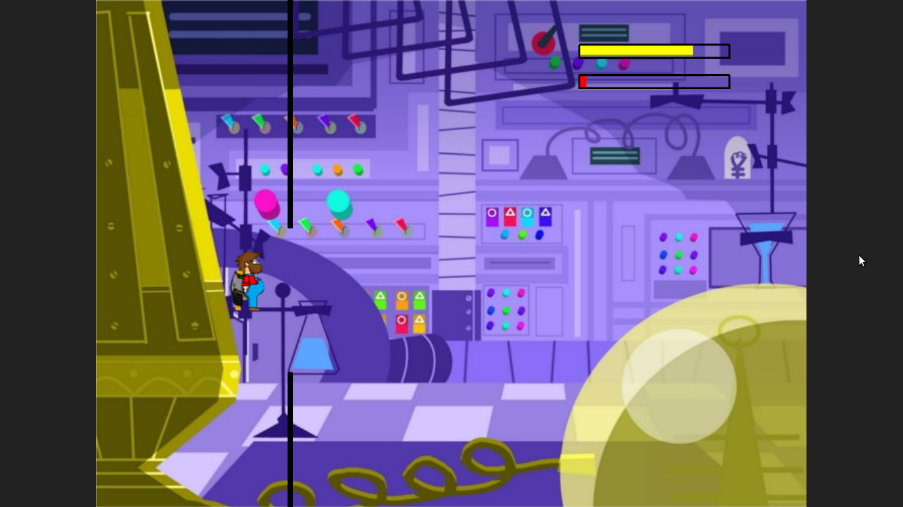
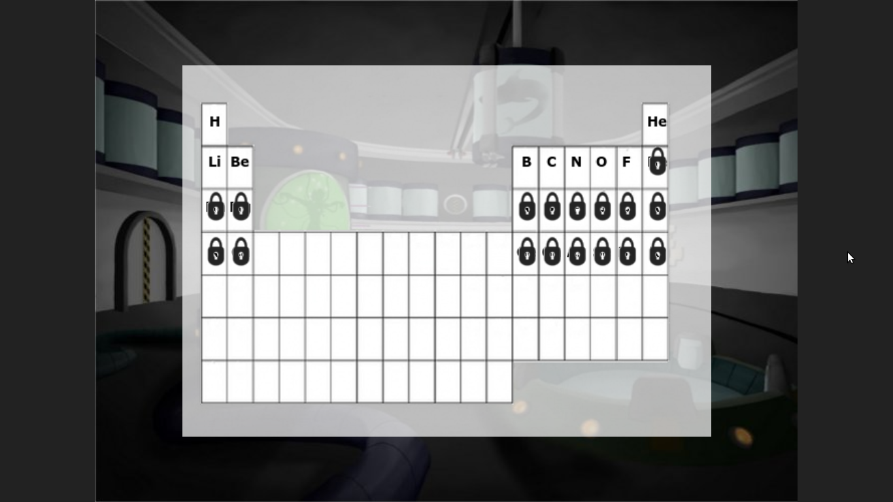

 
Mendeleiev-Bros
===============

Juego hecho en python utilizando el motor Pilas, en el cual tienes que sortear una serie de paredes para destruir el mundo.

¿En que consiste?
===============
Es un juego de plataformas, en el que tienes que esquivar las paredes que van apareciendo.
 

¿Como se juega?
===============
El manejo es muy simple. Con la tecla w se ascinede y cuando dejas de presionarla baja.

¿Que significa cada cosa?
===============
El juego tiene dos escenas principales, el menú y el juego.
El menú, una vez dado a Comenzar a jugar, aparecerá una tabla periódica con los elementos(niveles) disponibles.
En el juego, hay dos barras que indican: La de arriba, el nivel de gasolina. La de abajo, los puntos, cuando se llena, pasas de nivel.
 

¿Como funciona el Jetpack?
===============
Jacinto(el protagonista), va a todos lados en jetpack, y este consume H2. Durante el juego hay moleculas que debes recojer para no quedarte sin y morir. 
